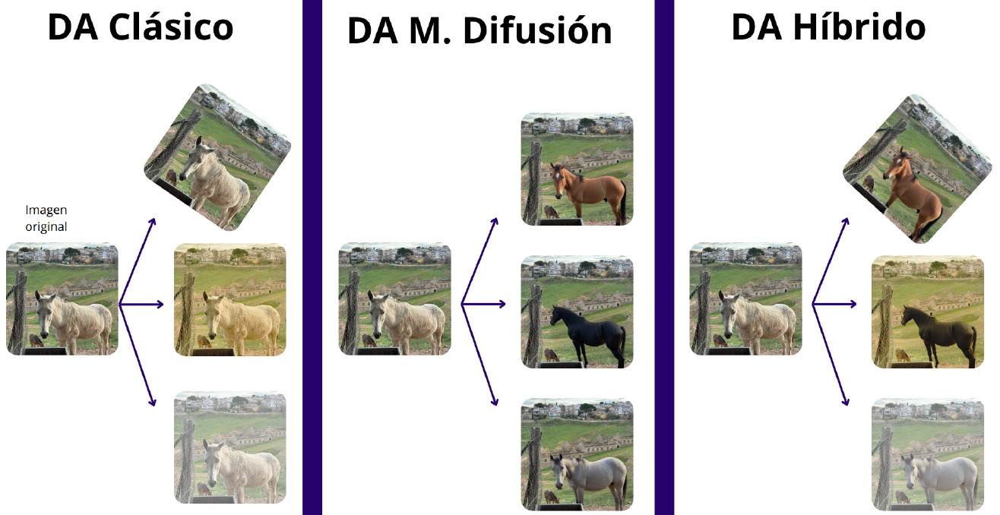
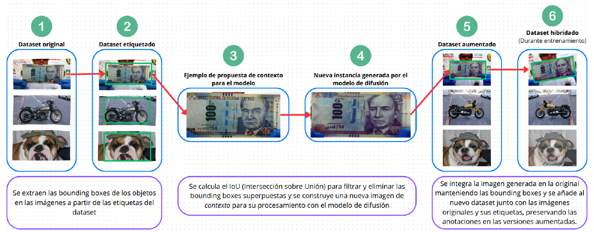
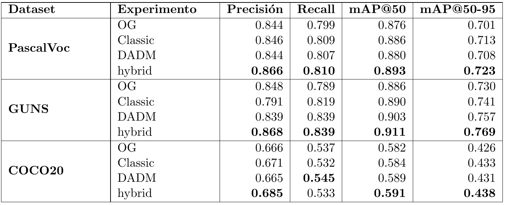

# 🎓 Trabajo Fin de Grado – Data Augmentation con Modelos de Difusión  
### Alfonso Julián Zapata Velasco

Este repositorio contiene el código y los experimentos de mi Trabajo de Fin de Grado (TFG), cuyo objetivo es **evaluar si los modelos de difusión pueden mejorar la detección de objetos mediante técnicas de data augmentation**.

---

## 🌀 ¿Qué es un modelo de difusión?

Los modelos de difusión se entrenan para revertir un proceso de perturbación progresiva del ruido en los datos, generando así nuevas muestras realistas. Este enfoque ha demostrado ser especialmente prometedor para **generar imágenes sintéticas de alta calidad**.

---

## 🔁 Forward Process (Difusión)

> A lo largo del forward process, una imagen se convierte progresivamente en ruido puro.


---

## 🔄 Reverse Process (Denoising)

> En el reverse process, el modelo aprende a reconstruir imágenes realistas a partir de ruido, paso a paso.


---

## 📝 Créditos de las imágenes

Los GIFs han sido obtenidos del blog de [Aaron Lou](https://aaronlou.com/blog/2023/reflected-diffusion/), que ofrece una explicación visual excelente del funcionamiento de estos modelos.

---
## 📌 Objetivo del Proyecto

Este proyecto busca responder a la pregunta:  
**¿Es posible mejorar la detección de objetos utilizando modelos de difusión para generar datos sintéticos?**

---

## 💡 Propuesta



La imagen anterior ilustra el objetivo principal: **mejorar la robustez de los modelos de detección** entrenándolos no solo con aumentos clásicos (como flips o recortes), sino también con imágenes sintéticas generadas mediante modelos de difusión.

---

## ⚙️ Pipeline propuesto



El pipeline diseñado incorpora un proceso de *data augmentation generativo* basado en modelos de difusión. A través de este sistema, se generan imágenes realistas que enriquecen el dataset de entrenamiento y permiten comparar cuatro configuraciones:

- **OG** (original): sin data augmentation.
- **Classic**: aumentos tradicionales.
- **DADM**: solo aumentos mediante modelos de difusión.
- **Hybrid**: combinación de Classic y DADM.

---

## 📊 Resultados



Los experimentos se realizaron sobre tres datasets:

- 📦 **Pascal VOC** – [Sitio oficial](https://host.robots.ox.ac.uk/pascal/VOC/)
- 🎯 **OD Weapon Detection (GUNS)** – [Artículo original](https://arxiv.org/abs/1702.05147)
- 🧪 **COCO20** – Subconjunto del dataset [MS COCO](https://cocodataset.org), limitado al 20% por restricciones computacionales.

---

### 🔍 Análisis

- En **Pascal VOC** y **GUNS**, el enfoque **híbrido** logra las mejores métricas en todas las categorías, especialmente en **mAP@50-95**, donde destaca con hasta **+2% de mejora** respecto a los métodos clásicos.
- En **COCO20**, aunque las puntuaciones son más bajas en general, el patrón se mantiene: el uso de modelos de difusión mejora el rendimiento.
- Esto respalda la utilidad de la generación sintética mediante difusión para escenarios con **datos limitados o especializados**.

---

## ✅ Conclusión

El enfoque híbrido propuesto demuestra que la combinación de estrategias clásicas con modelos de difusión es efectiva para **mejorar el rendimiento de modelos de detección de objetos**, especialmente en contextos donde los datos son escasos o difíciles de recolectar.

---

## 📂 Estructura del Repositorio


```
📁 TFG
│── 📁 CreateDatasets        # Scripts para crear nuevas versiones de los datasets originales
│   ├── 📁 COCO
│   │   ├── CreateDM.py             # Generación de datasets con Modelos de Difusión
│   │   ├── CreateDM2.py            # Variación del dataset con Modelos de Difusión
│   │   ├── CreateDMSegunSize.py    # DA+DM según tamaño del objeto
│   │   ├── CreateDifficultDataset.py
│   │   ├── CreateDifficultDatasetDADM.py
│   │   ├── CreateHibridDatasetDMCLA.py
│   ├── 📁 Weapons
│   │   ├── CreateDM.py
│   │   ├── CreateHibridDatasetDMCLA.py
│
│── 📁 datasets            # Almacena los datasets (no se incluye en GitHub por espacio)
│   ├── 📁 COCO            # Original y versiones generadas con DA
│   ├── 📁 Weapons         # Original y versiones generadas con DA
│   ├── 📁 VisDrone        # Original y versiones generadas con DA
│
│── 📁 docs                # Documentación y dependencias del proyecto
│   ├── environment.yml    # Configuración del entorno Conda
│   ├── requirements.txt   # Dependencias del proyecto
│
│── 📁 experimentacion     # Notebooks de experimentación y análisis de métricas
│   ├── experimentacion.ipynb      # Experimentos y métricas para COCO
│   ├── GUNexperimentacion.ipynb   # Experimentos y métricas para Weapons ⭐
│
│── 📁 MetricasDeEntrenamientos  # Almacenamiento y conversión de métricas de entrenamiento
│   ├── coco_20.txt, coco_20_DA_DM_segun_size.txt, ...
│   ├── convertCSV.py            # Conversión de métricas a CSV
│   ├── metricas_entrenamientos.xlsx
│   ├── metricas_entrenamientos.csv
│
│── 📁 Modelos             # Evaluación de diferentes modelos de detección de objetos
│   ├── SSD.ipynb          # Pruebas con SSD
│   ├── fasterRCNN.ipynb   # Pruebas con Faster R-CNN
│   ├── yolo.ipynb         # Pruebas con YOLO
│
│── 📁 nbCoco              # Scripts y notebooks para trabajar con COCO
│   ├── InvestigacionCoco.ipynb   # Exploración de COCO
│   ├── download_coco.py         # Script para descargar COCO
│
│── 📁 nbInpainting        # Investigación sobre modelos de difusión e inpainting
│   ├── inpainting.ipynb
│
│── 📁 nbVisDrone          # Evaluación de Modelos de Difusión en VisDrone
│   ├── TomaContactoVisDrone.ipynb
│
│── 📁 TrainModels         # Scripts para lanzar entrenamientos con diferentes variantes de DA
│   ├── 📁 COCO
│   │   ├── entrenamiento.py
│   │   ├── entrenamientoDAMD.py
│   │   ├── entrenamiento_DA.py
│   │   ├── entrenamiento_DAMD_segun_size.py
│   │   ├── entrenamiento_DA_hibrid.py
│   │   ├── entrenamiento_difficult.py
│   │   ├── entrenamiento_difficult_DADM.py
│   ├── 📁 Weapons
│   │   ├── fineTunningDADM.py
│   │   ├── fineTunningDAclassic.py
│   │   ├── fineTunningOG.py
│
│── script_entrenamiento.sh          # Script para lanzar entrenamientos en Dionisio
│── script_entrenamiento_cualquierNodo.sh # Script para lanzar entrenamientos en Atenea
│── README.md                         # Documentación principal del repositorio
```


---

## 🔬 Metodología

1. **Entrenamiento de modelos de detección de objetos**  
   - YOLO, Faster R-CNN, SSD sobre COCO, VisDrone y Weapons.
2. **Generación de datos sintéticos con modelos de difusión**  
   - Aplicación de inpainting y generación de imágenes sintéticas.
3. **Comparación de rendimiento**  
   - Evaluación de modelos con y sin data augmentation generativo.
   - Evaluación de las diferentes aproximaciones con data augmentation generativo.
4. **Análisis de métricas**  
   - Uso de las métricas para medir impacto.

---

[Acceso a hoja de cálculo con todas las métricas ACTUALIZAR ESTO](ACTUALIZAR ESTO)

---

## ⚙️ Instalación y Dependencias

Para ejecutar los notebooks, instala las dependencias con:

```bash
pip install -r requirements.txt
```

Es recomendable utilizar un entorno con:
- Python 3.7+
- PyTorch
- TensorFlow (opcional)
- OpenCV
- COCO API
- Detectron2 (para Faster R-CNN)
- Git LFS (para manejar archivos grandes)
- Diffusers (para modelos de difusión)
- Transformers (para modelos generativos)
- Pandas y NumPy (para manipulación de datos)
- Matplotlib y Seaborn (para visualización)
- SciPy y Scikit-learn (para análisis estadístico y preprocesamiento)

---

## 📀 Resultados Esperados
Se analizará si los modelos de difusión pueden **generar datos sintéticos útiles** para mejorar el rendimiento de los detectores de objetos. También se comparará su impacto frente a otras técnicas tradicionales de data augmentation.

---
## 📌 **Autor**  
**Alfonso Julián**  

## 📂 **Repositorio GitHub**  
🔗 [TrabajoFinDeGrado](https://github.com/AlfonsoJulian/TFG)  

## 📅 **Periodo académico**  
🗓️ 2024/2025  

## 📑 **Investigación previa (Primer Cuatrimestre)**  
🔗 [Trabajo de investigación previo del primer cuatrimestre](https://github.com/AlfonsoJulian/TrabajoPrimerCuatriTFG)  

---

📚 ¡Cualquier feedback o sugerencia es bienvenido! 🚀