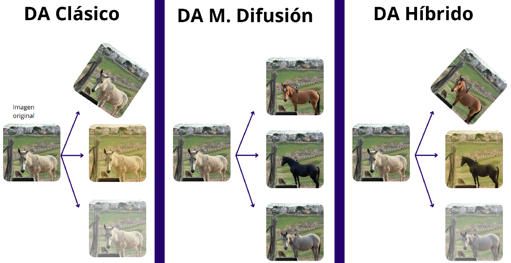
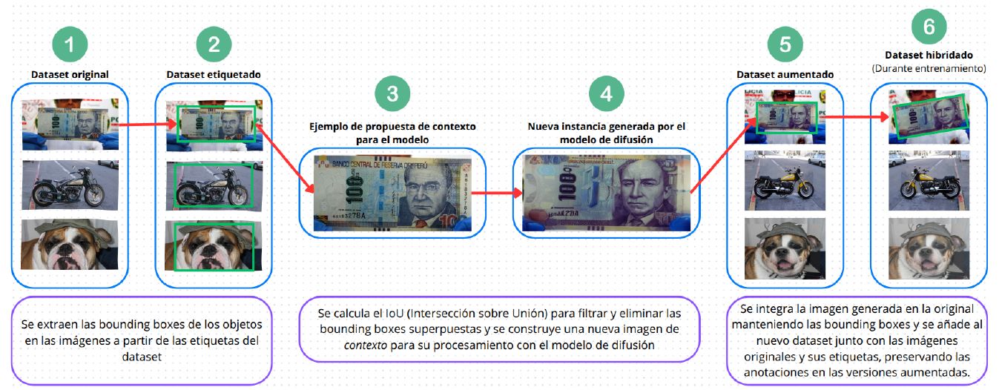
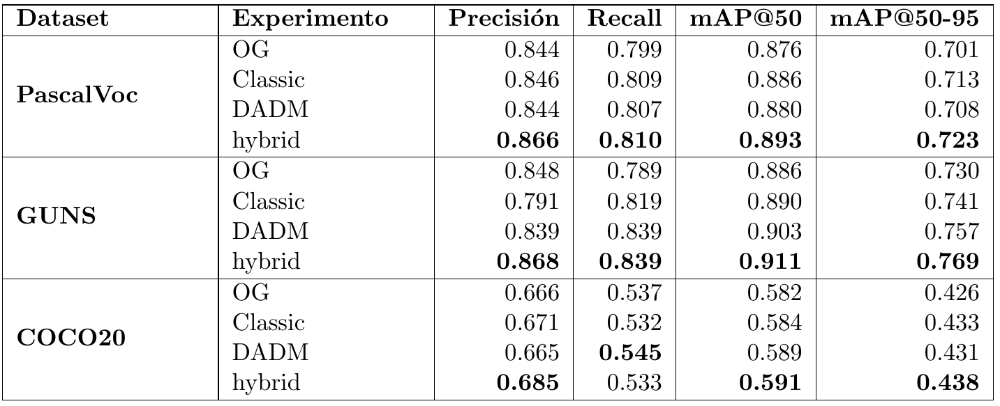

# 🎓 Trabajo Fin de Grado – Data Augmentation con Modelos de Difusión  
### Alfonso Julián Zapata Velasco

Este repositorio contiene el código y los experimentos de mi Trabajo de Fin de Grado (TFG), cuyo objetivo es **evaluar si los modelos de difusión pueden mejorar la detección de objetos mediante técnicas de data augmentation**.

> ⚠️ <mark><strong>NOTA IMPORTANTE: EL TFG EN PDF SE ENCUENTRA EN EL ARCHIVO TFG_AZAPATA_FIRMADO_MHB_AZAPATA.PDF</strong></mark>---

## 🌀 ¿Qué es un modelo de difusión?

Los modelos de difusión se entrenan para revertir un proceso de perturbación progresiva del ruido en los datos, generando así nuevas muestras realistas. Este enfoque ha demostrado ser especialmente prometedor para **generar imágenes sintéticas de alta calidad**.

---

## 🔁 Forward Process (Difusión)

> A lo largo del forward process, una imagen se convierte progresivamente en ruido puro.


---

## 🔄 Reverse Process (Denoising)

> En el reverse process, el modelo aprende a reconstruir imágenes realistas a partir de ruido, paso a paso.


---

## 📝 Créditos de las imágenes

Los GIFs han sido obtenidos del blog de [Aaron Lou](https://aaronlou.com/blog/2023/reflected-diffusion/), que ofrece una explicación visual excelente del funcionamiento de estos modelos.

---
## 📌 Objetivo del Proyecto

Este proyecto busca responder a la pregunta:  
**¿Es posible mejorar la detección de objetos utilizando modelos de difusión para generar datos sintéticos?**

---

## 💡 Propuesta



La imagen anterior ilustra el objetivo principal: **mejorar la robustez de los modelos de detección** entrenándolos no solo con aumentos clásicos (como flips o recortes), sino también con imágenes sintéticas generadas mediante modelos de difusión.

---

## ⚙️ Pipeline propuesto



El pipeline diseñado incorpora un proceso de *data augmentation generativo* basado en modelos de difusión. A través de este sistema, se generan imágenes realistas que enriquecen el dataset de entrenamiento y permiten comparar cuatro configuraciones:

- **OG** (original): sin data augmentation.
- **Classic**: aumentos tradicionales.
- **DADM**: solo aumentos mediante modelos de difusión.
- **Hybrid**: combinación de Classic y DADM.

---

## 📊 Resultados



Los experimentos se realizaron sobre tres datasets:

- 📦 **Pascal VOC** – [Sitio oficial](https://host.robots.ox.ac.uk/pascal/VOC/)
- 🎯 **OD Weapon Detection (GUNS)** – [Artículo original](https://arxiv.org/abs/1702.05147)
- 🧪 **COCO20** – Subconjunto del dataset [MS COCO](https://cocodataset.org), limitado al 20% por restricciones computacionales.

---

### 🔍 Análisis

- En **Pascal VOC** y **GUNS**, el enfoque **híbrido** logra las mejores métricas en todas las categorías, especialmente en **mAP@50-95**, donde destaca con hasta **+2% de mejora** respecto a los métodos clásicos.
- En **COCO20**, aunque las puntuaciones son más bajas en general, el patrón se mantiene: el uso de modelos de difusión mejora el rendimiento.
- Esto respalda la utilidad de la generación sintética mediante difusión para escenarios con **datos limitados o especializados**.

---

## ✅ Conclusión

El enfoque híbrido propuesto demuestra que la combinación de estrategias clásicas con modelos de difusión es efectiva para **mejorar el rendimiento de modelos de detección de objetos**, especialmente en contextos donde los datos son escasos o difíciles de recolectar.

---

## 📂 Estructura del Repositorio (Hay carpetas como los datasets que no están subidos debido a cuestiones de almacenamiento en github)

```
📁 TFG
├── 📁 CreateDatasets               # Scripts de creación de datasets con y sin difusión
├── 📁 ImagenesGit                 # Imágenes ilustrativas usadas en el README
├── 📁 MetricasDeEntrenamientos    # Resultados numéricos y métricas finales de los experimentos
├── 📁 TrainModels                 # Scripts de entrenamiento con diferentes variantes de DA
├── 📁 docs                        # Archivos de entorno y dependencias (environment.yml, requirements.txt)
├── 📁 experimentacion             # Notebooks con evaluación y visualización de resultados
├── 📁 modelos                     # Pruebas con SSD, Faster R-CNN y YOLO
├── 📁 nbCoco                      # Exploración del dataset COCO y descarga
├── 📁 nbInpainting                # Evaluación de modelos de difusión con tareas de inpainting
├── 📁 nbVisDrone                  # Experimentos preliminares con VisDrone (descartado)
├── 📄 .gitignore                  # Exclusión de carpetas pesadas y temporales
├── 📄 README.md                   # Documentación principal del repositorio
├── 📄 script_entrenamiento.sh     # Script para lanzar entrenamientos en Dionisio
└── 📄 script_entrenamiento_cualquierNodo.sh  # Script para lanzamientos flexibles en Atenea
```
## 📂 Archivos importantes

### 🧬 Generación de datos sintéticos

Archivo principal para aplicar data augmentation basado en modelos de difusión sobre cualquier dataset:
   `/mnt/homeGPU/azapata/TFG/CreateDatasets/COCO/coco20/CreateDM.py`

### 🏋️‍♂️ Entrenamiento de modelos con distintas configuraciones de DA

Scripts para lanzar los entrenamientos con distintas estrategias:

- **Clásico (Classic DA)**  
  `TFG/TrainModels/COCO20/fineTunningDAclassic.py`

- **Modelos de Difusión (DADM)**  
  `TFG/TrainModels/COCO20/fineTunningDADM.py`

- **Híbrido (Classic + DADM)**  
  `TFG/TrainModels/COCO20/fineTunningHibrid.py`

- **Original (sin data augmentation)**  
  `TFG/TrainModels/COCO20/fineTunningOG.py`

Nota:    
---

## ⚙️ Instalación y Dependencias

Para ejecutar los notebooks, instala las dependencias con:

```bash
pip install -r requirements.txt
```

Es recomendable utilizar un entorno con:
- Python 3.7+
- PyTorch
- TensorFlow (opcional)
- OpenCV
- COCO API
- Detectron2 (para Faster R-CNN)
- Git LFS (para manejar archivos grandes)
- Diffusers (para modelos de difusión)
- Transformers (para modelos generativos)
- Pandas y NumPy (para manipulación de datos)
- Matplotlib y Seaborn (para visualización)
- SciPy y Scikit-learn (para análisis estadístico y preprocesamiento)

---
## 🧠 Valor del Proyecto

Más allá de los resultados numéricos obtenidos, el verdadero valor de este Trabajo Fin de Grado radica en el **trabajo de experimentación e investigación exhaustiva** que ha sido necesario para construir un pipeline funcional, robusto y validado empíricamente.

El diseño, implementación y validación de un sistema de data augmentation basado en modelos de difusión no es una tarea trivial. Implica:

- 📊 Analizar el comportamiento de distintos modelos de detección frente a datos clásicos y sintéticos.
- 🔄 Adaptar y flexibilizar los pipelines de entrenamiento para trabajar con imágenes generadas artificialmente.
- 🧪 Ejecutar múltiples experimentos con distintos datasets, afinando hiperparámetros y evaluando con rigor.
- 🧱 Desarrollar código sólido y reutilizable para tareas críticas como la generación, conversión y evaluación de datos.

Este proceso ha requerido **horas de pruebas, iteraciones, ajustes finos y resolución de errores**, con una alta exigencia técnica y una planificación cuidadosa del uso de recursos computacionales. En particular, la parte experimental ha sido un desafío clave, tanto por la complejidad del pipeline como por la necesidad de **gestionar eficientemente el tiempo y la infraestructura disponible**.

Por todo ello, este proyecto no solo aporta una solución técnica viable, sino que representa **la madurez para llevar una idea compleja desde su concepción hasta su validación práctica**, atravesando todas las etapas del ciclo de vida de un proyecto de investigación aplicada en IA.

---

## 👤 Autor  
**Alfonso Julián Zapata Velasco**

## 🗂️ Repositorio principal  
🔗 [github.com/AlfonsoJulian/TFG](https://github.com/AlfonsoJulian/TFG)

## 🗓️ Periodo académico  
**Curso 2024 / 2025**  

## 🧪 Investigación previa (Primer cuatrimestre)  
Repositorio con experimentación inicial y exploraciones preliminares:  
🔗 [Trabajo de investigación previo](https://github.com/AlfonsoJulian/TrabajoPrimerCuatriTFG)

---

📬 *¡Cualquier feedback o sugerencia es bienvenido!*  
🚀 *Gracias por leer hasta aquí.*  
